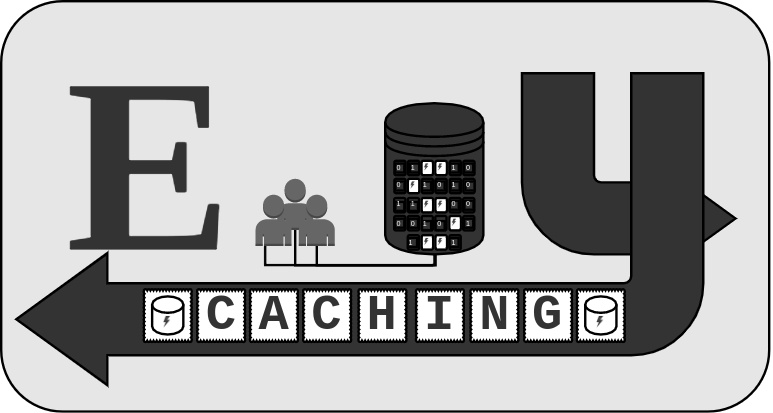

#

Shared, persistent, and smart caching 

## What is it?
easycaching provides a single shared interface for storing and retreiving data from memory among many processes(forks) of an application.

## Features
- fast and shared access to data
- persistent cache backed by a database
- auto-forking
- python syntax 

## Get Started
```bash
pip install easycaching
```

## Usage

```python
import asyncio
from easycaching import EasyCache

async def main():
    cache = await EasyCache.create(
        'test'
    )
    # set
    await cache.set('foo', 'bar')

    # get
    cached_value = await cache.get('foo')

    # set with json structured data
    await cache.set('foo_json', {'bar': 'bar_json'})

asyncio.run(main())

```

## FastAPI Usage

```python
# basic.py
from fastapi import FastAPI
from easycaching import EasyCache

app = FastAPI()

@app.on_event('startup')
async def start_cache():
    app.cache = await EasyCache.create(
        'test'
    )

@app.get('/cache')
async def view_cache(key: str):
    return {
        key:  await app.cache[key]
    }

@app.post('/cache')
async def set_cache(key: str, value: str):
    return await app.cache.set(key, {'json': value})
    
```
```bash
uvicorn --host 0.0.0.0 --port 8230 basic:app --workers=5
```

## Under the Hood
easycaching utilizes the smart caching of [aiopyql](https://github.com/codemation/aiopyql) to provide cache acesss, cache storage, and perhaps most importantly updates and invalidation.

Data access sharing is made possible via proxy methods using [easyrpc](https://github.com/codemation/easyrpc). A cache background task is created & managed by gunicorn which main application workers access via proxies. 


