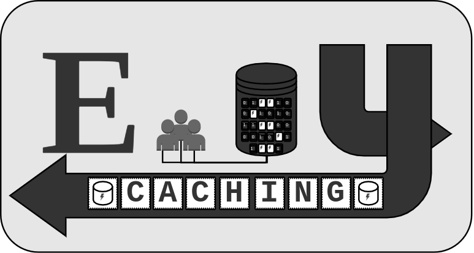

 

<h3>easycaching provides a single shared interface for storing and retreiving data from memory among many processes(forks) of an application. </h3>

### Features

- fast, shared, access to persistent data in memory
- auto-forking
- python syntax
- shared cache
- shared queues

### Github
[https://github.com/codemation/easycaching](https://github.com/codemation/easycaching)

##